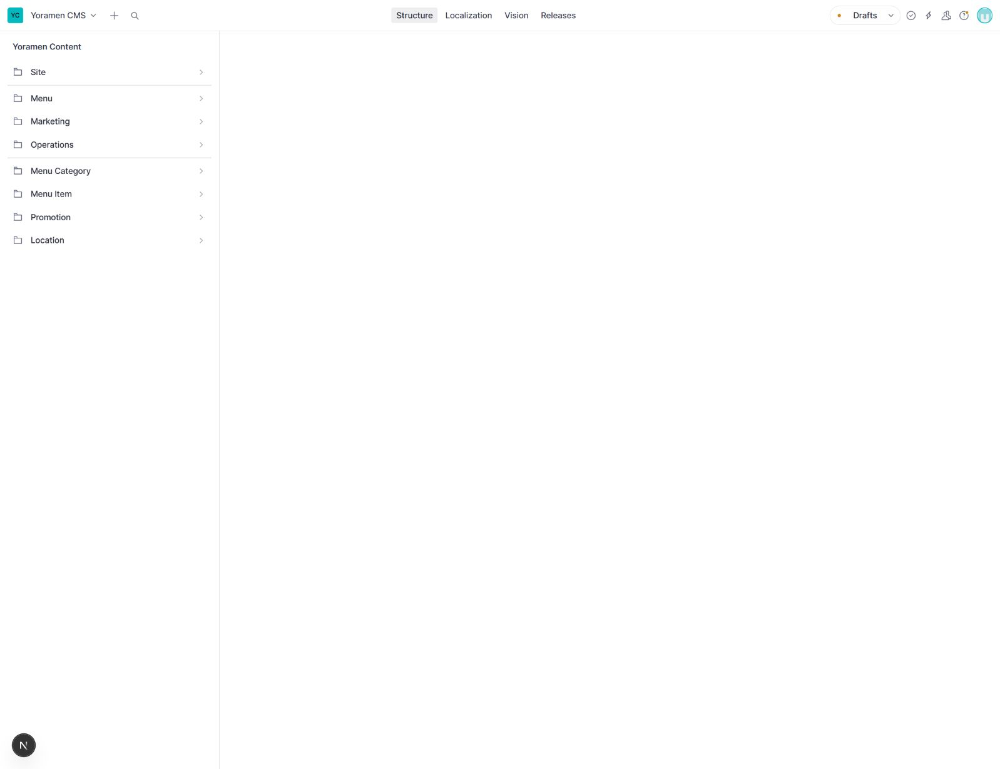
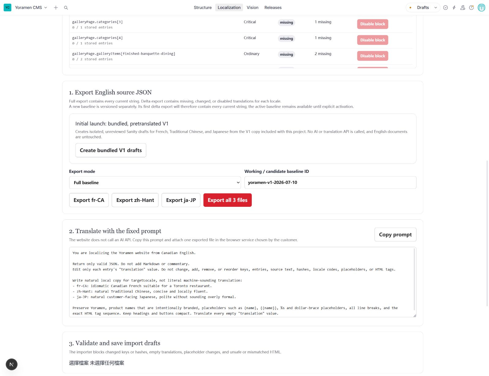
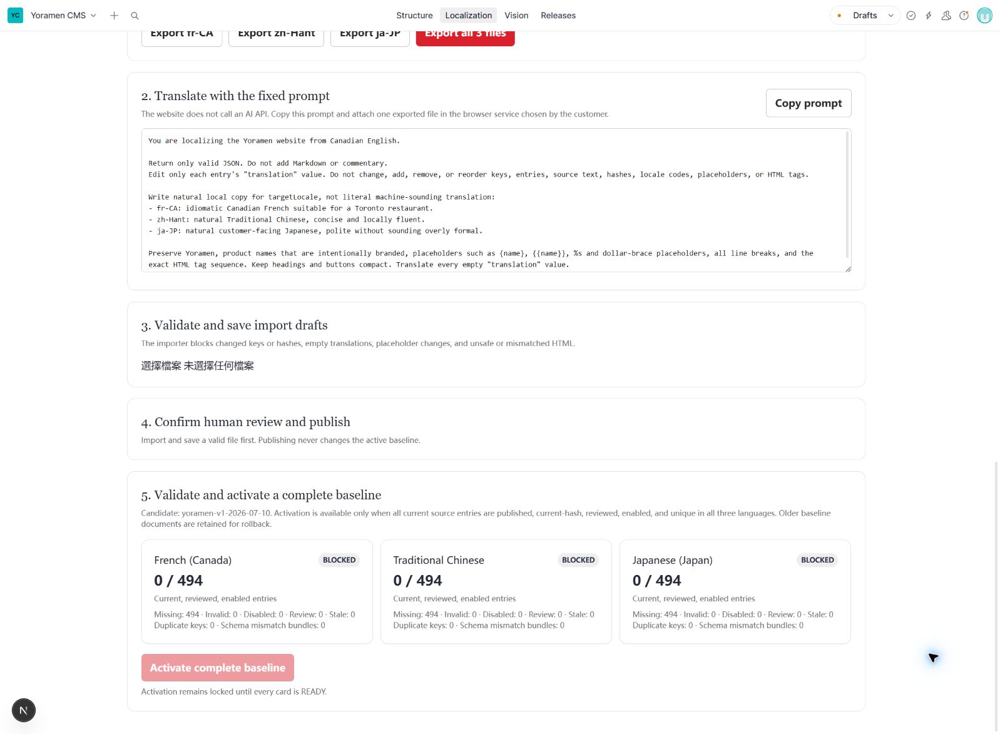
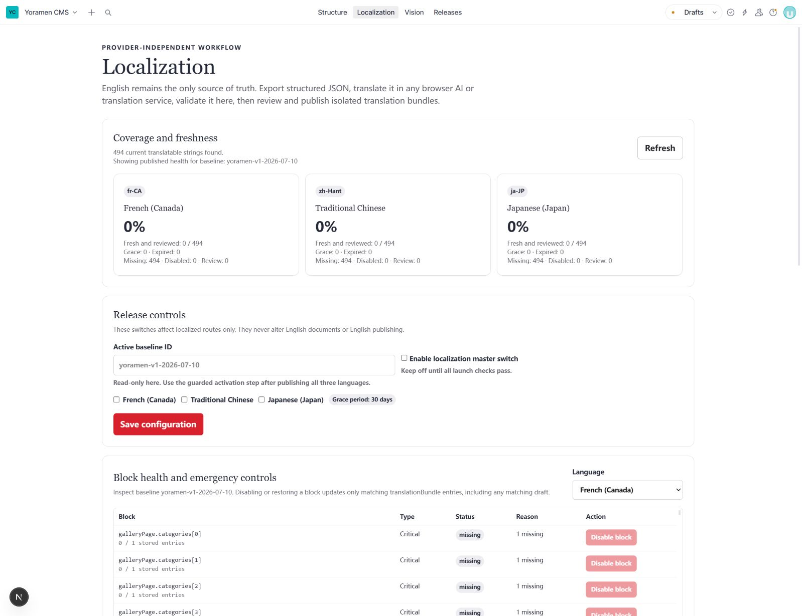
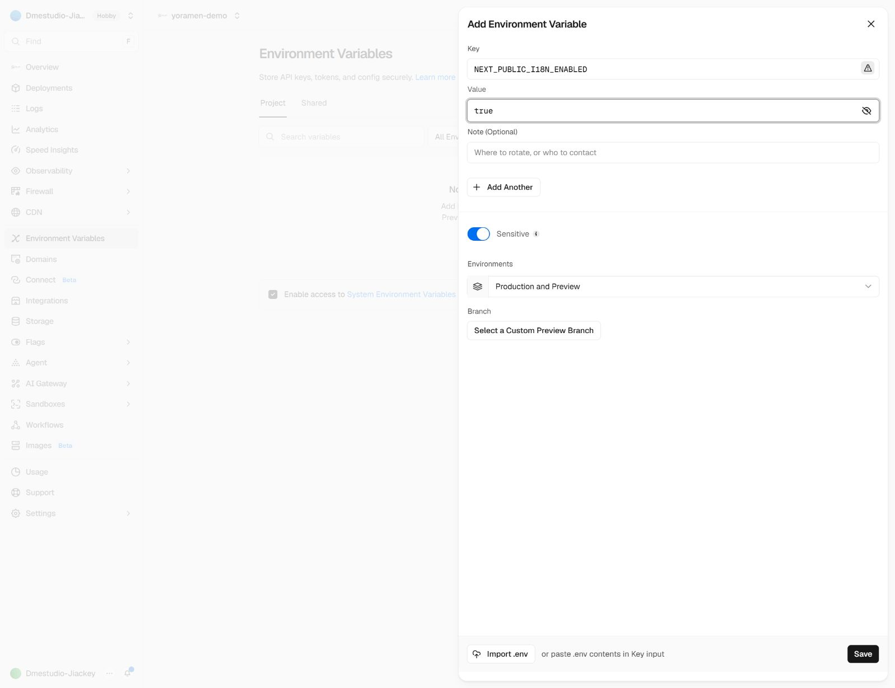

# Yoramen 多语言维护（图文极简版）

> 英语 `en-CA` 永远是唯一需要维护的源内容。法语、繁体中文和日语单独保存，不会覆盖英语 CMS 文档。
>
> 网站不接 ChatGPT API，也不会因为客户更新内容而自动扣 API 费用。需要翻译时，人工导出 JSON，交给网页 AI 或译者，再把 JSON 导回 Studio。

## 总的来说：

1. 平时继续在 **Structure** 里编辑和发布英语，原有操作不变。
2. 只有英语文案发生变化时，才需要进入 **Localization** 更新译文。
3. 首次上线或切换新 baseline 时，三张语言卡没有全部显示 **READY**，绝对不要开启多语言开关。
4. 缺失、过期或有结构错误的译文会回退到英语；不会把错误译文硬显示给访客。

---

## A. 首次上线：只做一次

### 1. 先保持多语言关闭

第一次部署代码时，Vercel 中先不要添加 `NEXT_PUBLIC_I18N_ENABLED=true`，或把它保持为 `false`。

此时英语网站、英语 URL、现有 CMS 和页面美术都照常工作，多语言 URL 会返回对应英语页面。

进入 `/studio`，点击顶部 **Localization**。



### 2. 创建已经准备好的首版翻译草稿

页面往下找到 **Initial launch: bundled, pretranslated V1**，点击：

**Create bundled V1 drafts**

它会一次建立法语、繁中和日语草稿；不会调用 AI，也不会修改英语内容。



> 重要：创建成功后，不要刷新页面、不要离开 Localization，也不要再次点击这个按钮。

### 3. 人工检查后发布

在同一个页面滚到 **4. Confirm human review and publish**。

创建草稿成功后，这里会出现：

- 一个人工审核确认框；
- **Mark reviewed and publish bundles** 按钮。

先检查法语、繁中和日语的主要页面、按钮、菜单、联系及订单文案，再勾选确认并发布。

> 下图现在看不到发布按钮是正常的：截图时我们没有创建任何草稿，也没有改动 Sanity 数据。按钮只会在步骤 2 成功后出现。

### 4. 只在三个语言都 READY 时激活

发布完成后，查看 **5. Validate and activate a complete baseline**。

只有法语、繁中和日语三张卡都显示 **READY**，才能点击：

**Activate complete baseline**

只要有一张显示 **BLOCKED**，就停在这里处理问题，不要继续开启语言。



### 5. 打开 Studio 中的发布开关

激活成功后回到页面顶部，在 **Release controls** 中勾选：

- Enable localization master switch
- French (Canada)
- Traditional Chinese
- Japanese (Japan)

然后点击 **Save configuration**。

> 这个保存按钮在未 READY 时也可能可以点击，所以必须人工遵守上面的顺序。



### 6. 最后才在 Vercel 打开网站入口

进入 Vercel 项目：

**Environment Variables → Add Environment Variable**

填写：

```text
Key:   NEXT_PUBLIC_I18N_ENABLED
Value: true
```

保存后重新部署，再检查 `/fr-ca`、`/zh-hant` 和 `/ja-jp` 的桌面端与手机端。



> 这张图只是填写位置示例。本次操作已经关闭表单，没有保存变量，也没有部署网站。

---

## B. 以后英语更新：用户通常只做这 6 步

### 1. 照常发布英语

客户继续在 **Structure** 中编辑并发布英语，不需要先处理其他语言。

### 2. 查看需要更新的译文

打开 **Localization**，点击 **Refresh**。

日常维护不要修改 **Working / candidate baseline ID**。它应与上方只读的 **Active baseline ID** 一致。

### 3. 导出三个小 JSON

把 **Export mode** 选为 **Changed strings only**，再点击 **Export all 3 files**。

浏览器会下载法语、繁中和日语三个 JSON，只包含新增、改动或需要修复的文案。

### 4. 每次只翻译一个文件

点击 **Copy prompt**，打开客户自己选择的网页 AI：

1. 上传一个 JSON；
2. 粘贴刚复制的固定 Prompt；
3. 让 AI 只返回完整、有效的 JSON；
4. 保存返回的 `.json` 文件。

网站和 Sanity 不需要任何 AI API Key。网页 AI 是否收费只取决于客户自己的账号或免费额度，不会产生网站的逐次 API 费用。也可以把同一文件交给人工译者。

#### 固定翻译 Prompt（复制下面完整内容）

将下面内容复制到所选的网页 AI，并同时附上从 Sanity Localization 导出的一个 JSON 文件。

```text
You are localizing the Yoramen website from Canadian English.

Return only valid JSON. Do not add Markdown or commentary.
Edit only each entry's "translation" value. Do not change, add, remove, or reorder keys, entries, source text, hashes, locale codes, placeholders, or HTML tags.

Write natural local copy for targetLocale, not literal machine-sounding translation:
- fr-CA: idiomatic Canadian French suitable for a Canadian restaurant.
- zh-Hant: natural Traditional Chinese, concise and locally fluent.
- ja-JP: natural customer-facing Japanese, polite without sounding overly formal.

Preserve Yoramen and intentionally branded product names. Keep Japanese culinary terms such as ramen, tonkotsu, chashu, ajitama, menma, nori, aburasoba, donburi and karaage natural for the target audience. Preserve placeholders such as {name}, {{name}}, %s and dollar-brace placeholders, all line breaks, and the exact HTML tag sequence.

Keep navigation labels, headings and buttons compact enough for the existing layout. Adapt idioms and rhythm instead of translating word by word. Use the entry context to avoid ambiguous wording. Translate every empty "translation" value and return the complete JSON object only.
```

#### 人工审核重点

- 法语使用加拿大法语，不使用明显的法国电商或餐饮措辞。
- 繁体中文使用自然、简洁的餐饮文案，并统一采用繁体字。
- 日语使用自然的顾客向表达，不逐字照搬英语语序。
- `Yoramen`、品牌饮料、地址、金额、营业时间数字和链接不得被改写。
- CTA、Navbar 和表单按钮不得因为译文过长而破坏布局。
- 检查菜单品名和描述中的食材、辣度及份数，不得改变事实。

### 5. 导入、审核、发布这一种语言

在 **3. Validate and save import drafts** 选择翻译后的 JSON。

看到 **No validation issues found** 后点击：

**Save grouped translationBundle drafts**

随后立刻在第 4 区完成：

1. 人工检查；
2. 勾选审核确认；
3. 点击 **Mark reviewed and publish bundles**。

完成这一种语言后，再处理下一个 JSON。

> 不要先导入三个文件再一起发布。每个语言都必须完整走完“导入 → 保存草稿 → 审核 → 发布”，过程中不要刷新、离开页面或选择下一个文件。

### 6. 检查状态

三个语言处理完后点击 **Refresh**。沿用当前 Active baseline 的日常更新，发布后会直接生效，不需要再次激活 baseline。

只有建立全新的 baseline 时，才需要等待三种语言全部 **READY**，再点击 **Activate complete baseline**。

---

## C. 出错时怎么回到英语

### 一个文案块有错

1. 点击 **Refresh**。
2. 确认 **Working / candidate baseline ID** 与 **Active baseline ID** 完全一致。
3. 在 **Block health and emergency controls** 选择出错的语言。
4. 找到错误块，点击 **Disable block**。

系统会自动保护页面：

- 一个普通块出错：该块原位置显示英语；
- 两个普通块出错，或任一关键块出错：整个页面返回对应英语页面；
- 查询失败或数据结构无法确认：整个页面返回英语。

修复错译要走：

**Disable → Delta 导出 → 修正 JSON → 导入 → 人工审核 → 发布**

不要直接点击 **Restore block** 恢复已知错译。Restore 只会取消“停用”，不会自动修好内容。

### 整个语言有问题

在 **Release controls** 关闭该语言并点击 **Save configuration**。语言入口会隐藏，已有语言 URL 会返回英语。

### 所有多语言都有问题

关闭 **Enable localization master switch** 并保存。

紧急情况下，也可以把 Vercel 的 `NEXT_PUBLIC_I18N_ENABLED` 改为 `false` 后重新部署。英语网站仍会继续工作。

### 客户长期没有维护

英语改动后，旧译文最多保留 30 天宽限期。超过 30 天仍未更新时，相关内容会按上述规则自动回退英语。

---

## 绝对不要做

- 首次上线或切换新 baseline 时，未全部 READY 就打开语言开关、总开关或 Vercel 生产变量。
- 没有真实人工检查就勾选“已审核”并发布。
- 日常维护时再次点击 **Create bundled V1 drafts**。
- 保存草稿后刷新、离开页面，或先选择下一种语言文件。
- 把 Known wrong（已知错误）的译文直接 Restore。
- 修改 AI 返回 JSON 中除 `translation` 以外的字段。

遇到红色错误提示、按钮消失或状态一直是 BLOCKED 时，停止操作并保留页面截图，不要尝试绕过门禁。
